# Crop-Pocalypse (CSCI 3300 Software Engineering Project)

## Overview

**Crop-Pocalypse** is an engaging and strategic game where players must protect their farm from alien invaders. Featuring multiple levels with increasing complexity, the game challenges players to devise tactics that safeguard their crops through each stage.

## Getting Started

### Prerequisites

Before you start, ensure you have the following software installed:

To play Crop-Pocalypse, follow these steps:
Download GoDot v4.2.1 [https://godotengine.org/]
Clone the repository to your local machine.
Open GoDot application and press import
Open project.gotdot inside the src>view folder
Press run button on top right

## Compiling the Project

1. **Open GoDot Engine**:
   - Launch the GoDot application on your computer.

2. **Import the Project**:
   - From the GoDot initial window, select 'Import Project'.
   - Navigate to the directory where you cloned the repository.
   - Select the `project.godot` file located inside the `src > view` folder and click 'Open'.

3. **Build the Project**:
   - Once the project is opened in GoDot, you can compile it by clicking on the **Run** button located at the top right corner of the editor.
   - GoDot will compile the scripts and assets to run the game.

4. **Running the Game**:
   - After compilation, the game will automatically start running within the GoDot editor.
   - You can also export the project to create executables for MacOS and Windows following GoDot’s exporting guidelines.

## Compatiblity

Crop-Pocalypse is compatible with the following operating systems:

MacOS: Ensure you have MacOS 10.13 or later.
Windows: Supports Windows 8 or newer.

## Model

### Model State

The game maintains a model state to keep track of various game elements such as the currentlevel, player status, and alien status.

### Character Class

The character class includes attributes such as setting and getting location, attack, and health of a character.

### Farmer Class

The farmer class inherits the Character class. And includes attributes that are essential for tracking the player's position and health throughout the game.

### Alien Class

The Alien class also inherits the Character class. Aliens are the primary adversaries in the game. The alien class defines characteristics and behaviors of the invading enemies.

### Grid Class

The game utilizes a system to determine whether a square on the game board is occupied and contains an enemy.

## View

### Prototype UI

The game features a prototype user interface (UI) designed to provide players with an engaging and intuitive gameplay experience. The UI elements include game controls, visual feedback, and essential information about the game state.

## Controller

### Main Method

The main method serves as the entry point for the game, orchestrating the initialization of game components and starting the gameplay loop.
Level Management: The controller includes methods to handle different game levels, such as Level 1, Level 2, and Level 3. Each level presents unique challenges and progression criteria for the player.
